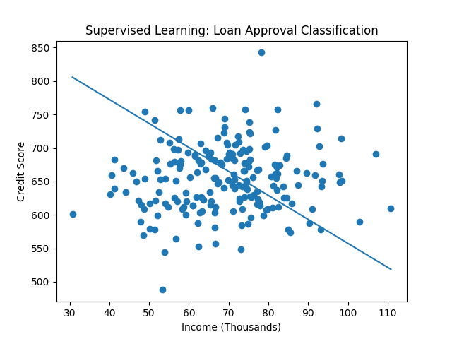
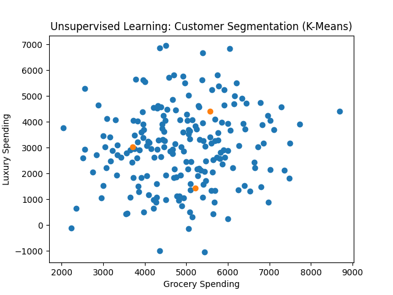

# Detailed Supervised vs Unsupervised Learning Example

------------------------------------------------------------------------

# 1️⃣ Supervised Learning Example: Loan Approval Classification

## Dataset Description

We simulate a loan approval dataset with:

-   Feature 1: Annual Income (in \$1000s)
-   Feature 2: Credit Score
-   Label: Loan Approved (1 = Yes, 0 = No)

The model does not know the approval rule. It must learn it from labeled
data.

## Model Used

Logistic Regression

The model learns a function:

    y = f(Income, Credit Score)

Where y is binary (approved or not).

## Visualization

The line represents the learned decision boundary separating approvals
from rejections.

------------------------------------------------------------------------

# 2️⃣ Unsupervised Learning Example: Customer Segmentation

## Dataset Description

We simulate customer spending behavior:

-   Feature 1: Annual Grocery Spending
-   Feature 2: Annual Luxury Spending

There are NO labels.

## Algorithm Used

K-Means Clustering

The algorithm attempts to group customers into clusters based purely on
similarity.

## Visualization

Cluster centers represent discovered customer segments.

------------------------------------------------------------------------

# Key Conceptual Difference

Supervised Learning: - Has labeled data - Learns to predict known
outcomes - Example: Loan approval prediction

Unsupervised Learning: - No labeled data - Learns hidden structure -
Example: Customer segmentation

------------------------------------------------------------------------

# Mathematical View

Supervised Learning:

    Given (X, y), learn mapping f(X) → y

Unsupervised Learning:

    Given X only, discover structure in X

------------------------------------------------------------------------

# Practical Interpretation

Supervised = Predictive Modeling\
Unsupervised = Exploratory Pattern Discovery

In real-world systems, both are often combined.
